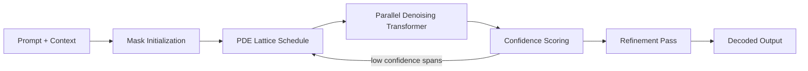
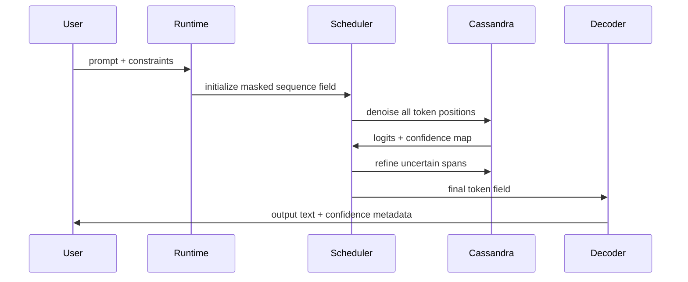

# Cassandra T1 Model Architecture

Cassandra T1 is a compact masked diffusion language model from SophiaXT. It is designed around parallel token denoising, PDE-inspired lattice scheduling, edge deployment, and workflow-specific reasoning.

This repository documents the public model architecture, information architecture, demo surface, and internal benchmark plan for Cassandra T1. It does not include model weights, private datasets, secrets, or production infrastructure credentials.

## Quick Facts

| Area | Cassandra T1 |
| --- | --- |
| Model class | Masked diffusion language model |
| Parameter target | 1.33B |
| Generation mode | Parallel denoising |
| Solver target | 8-16 denoising steps |
| Context target | 128K |
| Positioning | Edge-native workflow reasoning model |
| Deployment target | Consumer GPU, edge GPU, and optimized CPU/phone-class inference |

## Why Cassandra Exists

Autoregressive language models generate one token at a time. Cassandra T1 treats the sequence as a field: the model starts with masked positions and iteratively denoises the entire sequence in parallel.

The design goal is to approach the quality envelope of strong autoregressive reference models while reducing the number of forward passes needed for longer generations.

## Repository Map

- [Architecture Overview](docs/architecture-overview.md)
- [Information Architecture](docs/information-architecture.md)
- [Benchmark Methodology](docs/benchmark-methodology.md)
- [Demo Interface](docs/demo-interface.md)
- [Release Safety Notes](docs/release-safety.md)
- [Example TypeScript Client](examples/cassandra.demo.ts)

## Public Benchmark Position

The current website copy describes Cassandra T1 as targeting roughly a 98% quality envelope against a Gemma-style autoregressive reference across internal evaluation categories. Those numbers should be treated as internal benchmark targets until public reproducible evaluations and released model weights are available.

This repository separates:

- **Current architecture claims:** public design intent and implementation shape.
- **Internal benchmark board:** preliminary or target measurements.
- **Public benchmark release:** future reproducible evaluation with datasets, prompts, scoring scripts, and model hashes.

## Core Architecture



## Generation Loop



## Example

```ts
import { CassandraT1 } from "@sophiaxt/cassandra";

const model = await CassandraT1.load({
  weights: "cassandra-t1-int4.gguf",
  solver: "pde-lattice",
  steps: 12,
  device: "edge-gpu",
});

const output = await model.generate({
  prompt: "Summarize this repair log and route the next action.",
  maxTokens: 512,
  mode: "parallel-denoise",
});

console.log(output.text);
```

## Status

Cassandra T1 is documented as a SophiaXT model-family architecture package. Treat this repository as a public technical architecture and release-preparation repository, not a weights release.

## Ownership

Copyright 2026 SophiaXT LLC. All rights reserved unless a separate license file is added.

