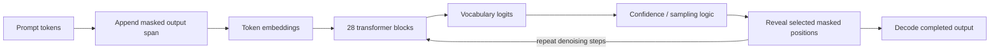

# Cassandra T1 Diffusion Edge Model

Cassandra T1 is an experimental SophiaXT language-model prototype built around masked diffusion rather than conventional left-to-right autoregressive decoding. This open release includes the PyTorch architecture, scheduler code, tokenizer, inference scripts, training scripts, and two released checkpoints. It is a real checkpoint release, but it should be understood as a proof of concept: the model demonstrates the training and inference path, while output quality still needs more training, evaluation, and cleanup before production use.

## Release Position

Cassandra T1 is a lab-stage architecture validation release. The purpose is to show the model family direction clearly: compact diffusion-style language generation, parallel masked-token refinement, PDE-inspired unmask scheduling, and a path toward edge-deployable SophiaXT models. The release is intentionally transparent about what works, what is measured, and what is still rough.

The verified epoch-5 checkpoint is the most stable checkpoint included here. The newer v2 scratch checkpoint is included because it is the latest artifact found in the source model directory, but current comparison notes indicate that newer checkpoint is not automatically better. Both artifacts are research checkpoints.

## Released Artifacts

| Artifact | Description | Reassembled size | SHA256 |
|---|---|---:|---|
| `weights/cassandra_ep5_fp16.pt.part001-002` | Verified epoch-5 Cassandra T1 FP16 checkpoint, split for GitHub LFS limits | 2,659,500,664 bytes | `D70C813C513F5232A25313FA60338F862020BA942ED26D54F62511766FA5F044` |
| `weights/v2_scratch_epoch2_82002.pt.part001-009` | Latest checkpoint found in `I:\sophiat1`, v2 scratch epoch 2 / step 82002, split for GitHub LFS limits | 16,665,974,950 bytes | `8BFB5644209AB8FD241D85A725781495B29922811A2BECF8260AAAAD0A26DA6F` |
| `release/tokenizer.json` | Cassandra tokenizer used by the released scripts | 2,253,607 bytes | `376A9537FCE79B7004237845E6B2C9991661E6BAEEA0B76AF9C9A3C1EB405C4D` |

GitHub rejected individual LFS objects above 2 GB, so the checkpoints are published as numbered parts. Part hashes are listed in `weights/checksums.sha256`.

## What the Prototype Demonstrates

Cassandra T1 demonstrates that the SophiaXT stack can move from architecture concept to trained checkpoint and runnable inference code. The release includes the core components needed to inspect that path:

- A PyTorch transformer architecture in `src/model/sophia_t1.py`.
- A typed configuration object in `src/model/config.py`.
- Masked-token training and generation utilities.
- PDE lattice and diffusion scheduler experiments in `src/scheduler/`.
- Training scripts for scratch training, continuation training, QLoRA experiments, and LoRA merge support.
- Local and Flask-based inference scripts for the epoch-5 checkpoint.
- A tokenizer artifact and checkpoint hashes for reproducibility tracking.

## Architecture Summary

Cassandra T1 is organized as a compact transformer language model trained and sampled through masked-token denoising. Instead of committing to each output token strictly from left to right, the model begins with masked output positions and progressively reveals tokens across multiple denoising passes.

Default T1-Base configuration:

| Component | Value |
|---|---:|
| Vocabulary | 32,768 tokens |
| Hidden size | 2,048 |
| Layers | 28 |
| Query heads | 16 |
| KV heads | 4 |
| FFN intermediate size | 5,632 |
| Position encoding | RoPE |
| Normalization | RMSNorm |
| Feed-forward | SwiGLU |
| Mask token ID | 32,766 |
| Pad token ID | 32,767 |
| Default inference denoise steps | 12 |



## Training Measurements

The source project notes record the following training trajectory for the epoch-5 line:

| Stage | Recorded loss |
|---|---:|
| Epoch 1 | 3.78 |
| Epoch 2 | 2.89 |
| Epoch 3 | 2.67 |
| Epoch 4 | 2.42 |
| Epoch 5 | 2.2561 |

These loss values are useful for understanding training progress, but they are not a public benchmark. The included qualitative notes say epoch 5 can produce better short factual answers than earlier checkpoints, while long-form generations remain unstable and can degrade after a short span.

The v2 scratch checkpoint is newer by timestamp and much larger, but the available comparison output shows unstable repetition and poor coherence. It is included for transparency and future analysis, not as a claim that it supersedes epoch 5.

## Inference Design

The released inference path is intentionally simple. A prompt is tokenized, a masked output region is appended, and the model repeatedly predicts masked positions. Candidate tokens are selected through confidence and sampling logic, then committed back into the sequence.

Key files:

- `scripts/run_cassandra.py`: local interactive CUDA inference for the epoch-5 checkpoint.
- `scripts/chunk_gen.py`: chunk-based generation experiment.
- `scripts/serve_ep5.py`: Flask server exposing an OpenAI-style chat endpoint.
- `src/eval/canary_identity.py`: canary-style identity/evaluation helper.

The scripts still contain original development-machine path assumptions. They are useful for technical review and local adaptation, but the release is not yet packaged as a clean installable runtime.

## Future Training Direction

The next training cycle should focus on stability, identity consistency, instruction following, and evaluation rather than simply adding more checkpoint files. The planned direction is:

- Continue from the most stable checkpoint, not automatically from the newest checkpoint.
- Increase identity and instruction-following data quality.
- Add structured evaluation prompts for appliance/service reasoning, general QA, code, spatial layout, and refusal/safety behavior.
- Integrate spatial tokens into the active data path before claiming native spatial behavior from trained outputs.
- Track loss, output samples, latency, memory use, and regression prompts for each checkpoint.
- Publish model-card notes per checkpoint with hashes, training data summary, decoding settings, and known failure modes.

## Repository Structure

```text
.
|-- README.md
|-- LICENSE
|-- docs/
|   |-- architecture.md
|   |-- research-paper.md
|   |-- training-settings.md
|   |-- inference-design.md
|   |-- benchmark-methodology.md
|   |-- limitations.md
|   `-- roadmap.md
|-- release/
|   |-- README.md
|   `-- tokenizer.json
|-- scripts/
|   |-- run_cassandra.py
|   |-- chunk_gen.py
|   |-- serve_ep5.py
|   `-- cassandra_train_only.py
|-- src/
|   |-- model/
|   |-- scheduler/
|   |-- train/
|   `-- eval/
|-- weights/
|   |-- README.md
|   |-- checksums.sha256
|   |-- cassandra_ep5_fp16.pt.part001
|   |-- cassandra_ep5_fp16.pt.part002
|   `-- v2_scratch_epoch2_82002.pt.part001-009
`-- showcase/
```

## Limitations

Cassandra T1 is not production-ready. The epoch-5 checkpoint is real and verified, but it still produces rough long-form output. The latest v2 scratch checkpoint is included, but comparison notes suggest it may be less coherent than epoch 5. No formal public benchmark suite is included yet. Training datasets are excluded. Quantized formats are not included because the custom architecture is not currently supported by the standard GGUF conversion path.

## License

This repository is released under the Apache License 2.0.

## Security and Data Boundary

Credentials, API keys, deployment notes, private server details, and private training datasets are intentionally excluded. The release is scoped to model code, tokenizer artifacts, checkpoint artifacts, and technical documentation.
