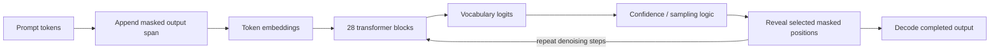

# Cassandra T1

**A masked-diffusion language model from SOPHIA XT.**
PyTorch architecture · verified epoch-5 FP16 checkpoint · tokenizer · training and inference scripts · Apache-2.0.

[](LICENSE)
[](#release-position)
[](#released-artifacts)
[](#architecture)

Cassandra T1 generates the output sequence as a **field**, not a line. The model begins with a span of masked positions and reveals tokens across all positions in parallel through a small number of denoising steps — instead of strictly committing each token left-to-right.

> **Honest scope.** Cassandra T1 is a research-stage release. The architecture works, the training path works, the verified checkpoint is real and runnable. Output quality still needs more training and structured evaluation before any production use. Limitations are stated up front in [§ Limitations](#limitations).

## Table of contents

1. [Release position](#release-position)
2. [Released artifacts](#released-artifacts)
3. [Quickstart](#quickstart)
4. [Architecture](#architecture)
5. [Training measurements](#training-measurements)
6. [Coherence comparison — T1 EP5 vs V2 scratch EP2](#coherence-comparison)
7. [Repository structure](#repository-structure)
8. [Inference design](#inference-design)
9. [Future training direction](#future-training-direction)
10. [Limitations](#limitations)
11. [Security and data boundary](#security-and-data-boundary)
12. [License](#license)

## Release position

Cassandra T1 is a **lab-stage architecture validation release**. The purpose is to show the model-family direction clearly: compact diffusion-style language generation, parallel masked-token refinement, PDE-inspired unmask scheduling, and a path toward edge-deployable SOPHIA XT models.

The repo ships:

- the PyTorch architecture (`src/model/sophia_t1.py`)
- the typed configuration object (`src/model/config.py`)
- masked-token training and generation utilities
- PDE-lattice and diffusion scheduler experiments (`src/scheduler/`)
- training scripts for scratch training, continuation, and QLoRA
- local interactive inference and a Flask chat-completion endpoint
- the tokenizer artifact and SHA-256 hashes for every binary

The verified **epoch-5 FP16 checkpoint** is the most stable artifact in the release. The newer **v2 scratch** checkpoint is included for transparency — it is larger and newer by timestamp, but it currently shows worse coherence than epoch 5 under the captured 10-prompt comparison. Both are research checkpoints, not production weights.

## Released artifacts

| Artifact | Description | Reassembled size | SHA-256 |
| --- | --- | ---: | --- |
| `weights/cassandra_ep5_fp16.pt.part001-002` | **Verified epoch-5 Cassandra T1 FP16 checkpoint.** Most stable artifact in the release; matches the inference scripts. | 2,659,500,664 bytes | `D70C813C513F5232A25313FA60338F862020BA942ED26D54F62511766FA5F044` |
| `weights/v2_scratch_epoch2_82002.pt.part001-009` | Newer v2 scratch checkpoint (step 82,002). Included for transparency; not a recommended baseline. | 16,665,974,950 bytes | `8BFB5644209AB8FD241D85A725781495B29922811A2BECF8260AAAAD0A26DA6F` |
| `release/tokenizer.json` | Cassandra tokenizer used by the released scripts. | 2,253,607 bytes | `376A9537FCE79B7004237845E6B2C9991661E6BAEEA0B76AF9C9A3C1EB405C4D` |

GitHub rejects single LFS objects above 2 GB, so checkpoints are published as numbered parts. Per-part hashes are listed in `weights/checksums.sha256` and validated by the quickstart commands below.

## Quickstart

The released artifacts are reassembled from the LFS parts before use.

```bash
# 1) Reassemble the verified epoch-5 FP16 checkpoint
cat weights/cassandra_ep5_fp16.pt.part00? > cassandra_ep5_fp16.pt

# 2) Verify against the published checksums
sha256sum -c weights/checksums.sha256

# 3) Local interactive CUDA inference (epoch-5 path)
python scripts/run_cassandra.py \
    --checkpoint cassandra_ep5_fp16.pt \
    --tokenizer release/tokenizer.json \
    --denoise-steps 12

# 4) Or stand up a Flask chat-completion endpoint
python scripts/serve_ep5.py --port 8080
```

The scripts retain a few original development-machine path assumptions; you may need to adjust paths for your environment. A clean installable runtime is on the roadmap.

## Architecture

T1-Base is a 28-layer transformer with grouped-query attention, SwiGLU feed-forwards, RoPE, and RMSNorm. Default inference uses 12 denoising steps over a masked output span.

| Component | Value |
| --- | ---: |
| Vocabulary | 32,768 tokens |
| Hidden size | 2,048 |
| Transformer layers | 28 |
| Query heads | 16 |
| KV heads | 4 |
| FFN intermediate size | 5,632 |
| Position encoding | RoPE |
| Normalization | RMSNorm |
| Feed-forward | SwiGLU |
| Mask token id | 32,766 |
| Pad token id | 32,767 |
| Default inference denoise steps | 12 |



The architecture is declared explicitly in `src/model/config.py`. The reference forward pass and decoder live in `src/model/sophia_t1.py`. The PDE-inspired mask schedule lives in `src/scheduler/pde_lattice.py`.

## Training measurements

Recorded loss for the epoch-5 line, taken directly from the source project notes:

| Stage | Recorded loss |
| --- | ---: |
| Epoch 1 | 3.78 |
| Epoch 2 | 2.89 |
| Epoch 3 | 2.67 |
| Epoch 4 | 2.42 |
| **Epoch 5** | **2.2561** |

These values document the trajectory. **They are not a public benchmark.** Cassandra T1 deliberately does not publish numbers we have not measured publicly. The qualitative source-project notes record that epoch 5 produces better short factual answers than earlier checkpoints, while long-form generations remain unstable.

## Coherence comparison

A captured 10-prompt qualitative comparison between **T1 epoch 5** and **V2 scratch epoch 2 / step 82,002** is included at:

```
eval/v2-ep2-vs-t1-ep5-coherence-raw.txt
docs/coherence-comparison-v2-ep2-vs-t1-ep5.md
```

Same prompt set, both checkpoints, raw text output. Summary:

- **T1 epoch 5** — outputs are still fragmented and contain corrupted token pieces, but the model samples a wider vocabulary and surfaces *domain-relevant* fragments (appliance, technical, architecture, denoising, Sophia). Distributional structure is forming; instruction alignment is not yet stable.
- **V2 scratch epoch 2** — severe repetition collapse. Output dominated by `left right left right` scaffolding tokens across most prompts. Newer-by-timestamp does not mean better.

Conclusion: **checkpoint selection should be evaluation-driven, not file-size or timestamp driven.** Epoch 5 remains the more useful baseline for continuing inference work.

## Repository structure

```text
.
├── README.md
├── LICENSE
├── PUBLICATION_CHECKLIST.md
├── docs/
│   ├── architecture.md
│   ├── architecture-overview.md
│   ├── benchmark-methodology.md
│   ├── coherence-comparison-v2-ep2-vs-t1-ep5.md
│   ├── demo-interface.md
│   ├── eval-script.md
│   ├── inference-design.md
│   ├── information-architecture.md
│   ├── limitations.md
│   ├── model-development.md
│   ├── overview.md
│   ├── release-safety.md
│   ├── research-paper.md
│   ├── roadmap.md
│   ├── technology-stack.md
│   ├── training-settings.md
│   └── why-cassandra-t1.md
├── eval/
│   └── v2-ep2-vs-t1-ep5-coherence-raw.txt
├── examples/
├── release/
│   ├── README.md
│   └── tokenizer.json
├── scripts/
│   ├── cassandra_train_only.py
│   ├── chunk_gen.py
│   ├── run_cassandra.py
│   ├── serve_ep5.py
│   └── smoke_pretrain.py
├── showcase/
│   ├── cassandra-t1-showcase.md
│   └── sophiaxt-stack.md
├── src/
│   ├── model/
│   │   ├── config.py
│   │   ├── sophia_t1.py
│   │   └── spatial_tokens.py
│   ├── scheduler/
│   │   ├── pde_lattice.py
│   │   └── pde_scheduler.py
│   ├── train/
│   │   ├── continue_from_ep5.py
│   │   ├── merge_lora.py
│   │   ├── pretrain_from_scratch.py
│   │   ├── train_diffusion.py
│   │   └── train_qlora.py
│   └── eval/
│       └── canary_identity.py
└── weights/
    ├── README.md
    ├── checksums.sha256
    ├── cassandra_ep5_fp16.pt.part001
    ├── cassandra_ep5_fp16.pt.part002
    └── v2_scratch_epoch2_82002.pt.part001-009
```

## Inference design

The released inference path is intentionally simple. A prompt is tokenized, a masked output region is appended, and the model repeatedly predicts masked positions. Candidate tokens are selected through confidence + sampling logic, then committed back into the sequence.

| Script | Purpose |
| --- | --- |
| `scripts/run_cassandra.py` | Local interactive CUDA inference for the epoch-5 checkpoint. |
| `scripts/chunk_gen.py` | Chunk-based generation experiment. |
| `scripts/serve_ep5.py` | Flask server exposing an OpenAI-style chat-completion endpoint. |
| `src/eval/canary_identity.py` | Canary-style identity / regression evaluation helper. |

## Future training direction

The next training cycle is for **stability, identity consistency, instruction following, and evaluation** — not just adding more checkpoint files.

- Continue from the most stable checkpoint, not automatically from the newest one.
- Increase identity and instruction-following data quality.
- Add structured evaluation prompts: appliance/service reasoning, general QA, code, spatial layout, refusal/safety.
- Integrate spatial tokens into the active data path before claiming native spatial behavior.
- Track loss, output samples, latency, memory, and regression prompts per checkpoint.
- Publish per-checkpoint model cards with hashes, training-data summary, decoding settings, and known failure modes.

## Limitations

Stated up front so reviewers can evaluate accurately:

- **Not production-ready.** Output quality still needs more training and structured evaluation.
- **Long-form generation is unstable.** Short factual answers are more reliable than long passages.
- **No formal public benchmark suite is included yet.** We refuse to publish numbers we have not measured publicly.
- **Training datasets are excluded** for safety and licensing reasons.
- **No quantized GGUF artifact** — the custom architecture is not currently supported by the standard GGUF conversion path.
- **Inference scripts retain dev-machine path assumptions.** A clean installable runtime is future work.

## Security and data boundary

Credentials, API keys, deployment notes, private server details, and private training datasets are intentionally excluded. The release is scoped to model code, tokenizer artifacts, checkpoint artifacts, and technical documentation.

## License

Released under the **Apache License 2.0**. See [`LICENSE`](LICENSE).

---

Cassandra T1 is part of the SOPHIA XT model family · [sophiaxt.com/models/cassandra](https://sophiaxt.com/models/cassandra)
