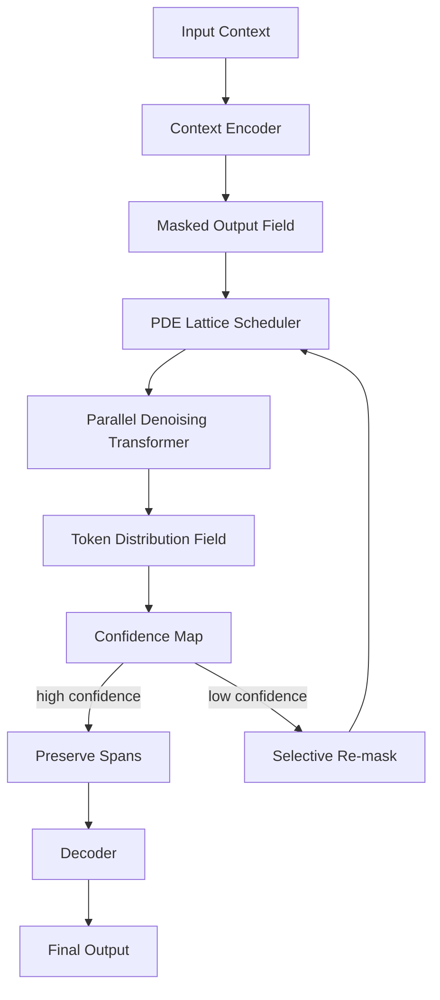

# Architecture Overview

Cassandra T1 is a masked diffusion language model that generates a sequence by repeatedly denoising all token positions in parallel. Its architecture is designed for workflow reasoning, edge inference, long-context synthesis, and structured operational tasks.

## Answer First: What Is Cassandra T1?

Cassandra T1 is a compact diffusion language model that solves from masked uncertainty toward readable output through a PDE-inspired denoising schedule. It is designed to reduce sequential generation bottlenecks common in autoregressive models.

## Design Goals

- Generate many token positions in parallel.
- Reduce long-generation latency by using 8-16 refinement steps instead of one forward pass per output token.
- Preserve ordered reasoning for workflow, logistics, diagnostics, document QA, and code repair prompts.
- Support edge deployment through quantized packages.
- Expose confidence maps so uncertain spans can be refined selectively.

## High-Level Components

### 1. Context Encoder

The context encoder receives prompt text, task metadata, retrieved documents, workflow state, and optional structured constraints. Its role is to convert business or technical context into a representation that can seed the denoising field.

### 2. Mask Initialization

Instead of starting from the first token and moving left-to-right, Cassandra initializes a masked output field. Tokens begin as unknown spans, anchors, or partially constrained regions.

### 3. PDE Lattice Scheduler

The scheduler controls how much uncertainty remains at each denoising step. A smooth S-curve schedule is used as a design target:

```text
gamma(t) = 1 - (3t^2 - 2t^3)
```

The schedule starts broadly, establishes semantic anchors, and then concentrates refinement on low-confidence spans.

### 4. Parallel Denoising Transformer

The denoising transformer predicts token distributions across the sequence in parallel. Each step updates the entire field instead of appending a single next token.

### 5. Confidence Map

Each token position receives a confidence score. The runtime can preserve high-confidence spans and re-mask low-confidence spans for additional refinement.

### 6. Decoder

The decoder converts the final denoised field into readable text, structured JSON, code, or other supported output formats.

## Architectural Diagram



## Intended Use Cases

- Workflow summaries
- Dispatch and routing recommendations
- Technical diagnostic reasoning
- Repair log analysis
- Document QA
- Code repair prompts
- Structured business reports
- Local or edge inference where latency and footprint matter

## Non-Goals

Cassandra T1 is not positioned as a universal replacement for large autoregressive foundation models. It is designed for constrained workflow reasoning and efficient generation where parallel refinement is a practical advantage.

