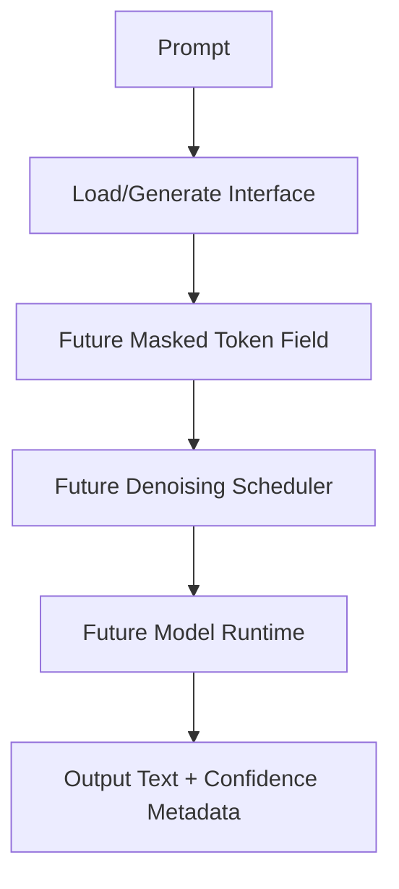

# Architecture Overview

Cassandra T1 is documented as a masked-diffusion language model concept. The current repository does not include the actual neural network implementation, so this file describes the architecture direction and the interface currently present in the public codebase.

## Answer First: What Is Cassandra T1?

Cassandra T1 is an early SophiaXT architecture concept for masked-diffusion language generation. The public repository currently contains documentation and a placeholder TypeScript demo client, not a complete model runtime.

## Design Goals

- Explore parallel token denoising instead of strict left-to-right generation.
- Document a future PDE-lattice scheduling concept.
- Provide a developer-facing load/generate interface shape.
- Prepare the repo for future tokenizer, training, inference, evaluation, and deployment assets.
- Keep the 5-epoch proof-of-concept status clear.

## Components Present In The Repository

- `examples/cassandra.demo.ts`: placeholder TypeScript demo client.
- `.env.example`: placeholder endpoint variables.
- Markdown documentation.
- Apache 2.0 license.

## Components Not Present

No actual transformer implementation, embedding layer, attention layer, tokenizer, diffusion scheduler, loss function, optimizer, dataset loader, checkpoint loader, or serving layer was found.

## Conceptual Architecture

This diagram reflects the intended direction. It is not a representation of complete code currently present in the repository.

## Intended Use Cases

- Workflow summaries
- Dispatch or routing notes
- Repair-log analysis
- Document QA
- Code repair prompts
- Structured business reports
- Local or edge-oriented assistant workflows

## Non-Goals

Cassandra T1 is not presented as a production-ready model, a benchmark-leading release, or a universal replacement for autoregressive language models.

