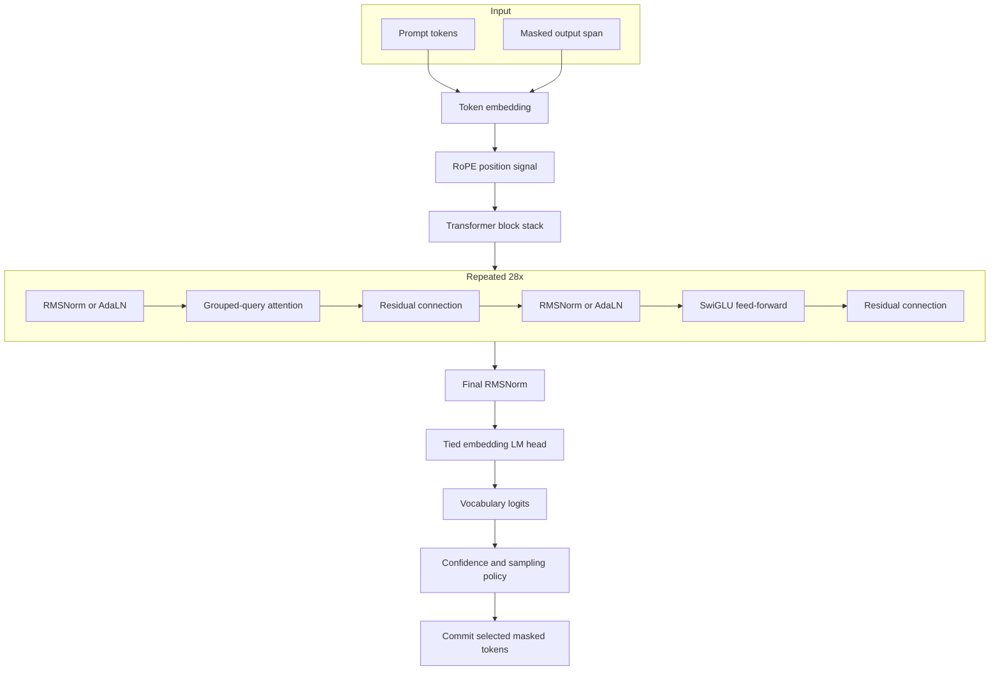
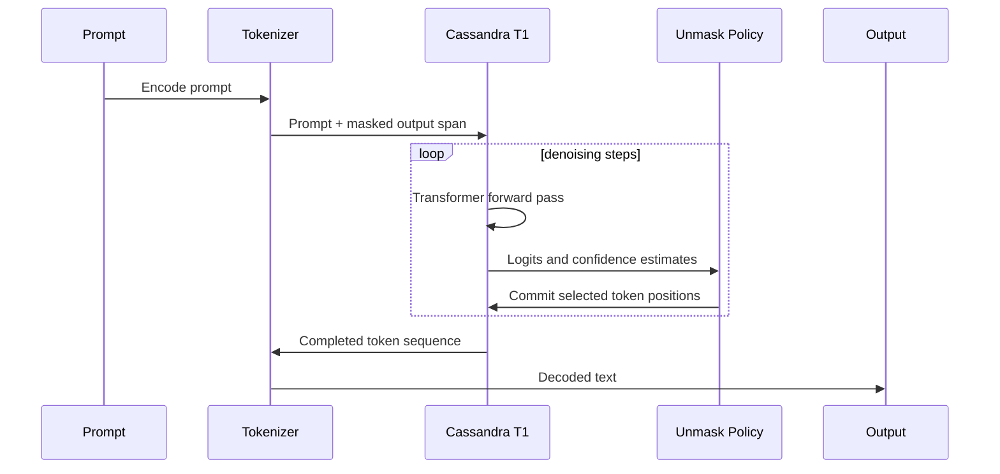
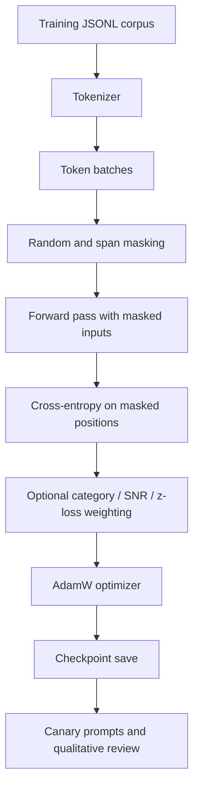

# Cassandra T1 Architecture

Cassandra T1 is a compact transformer prototype trained and sampled as a masked-diffusion language model. The architecture is not presented as a finished alternative to mature autoregressive systems. It is a research implementation that tests a specific idea: text can be generated by repeatedly refining masked positions across the whole candidate output, rather than only extending a sequence one token at a time.

The current implementation lives in `src/model/sophia_t1.py`, with configuration in `src/model/config.py` and scheduler experiments in `src/scheduler/`.

## Architectural Thesis

Autoregressive language models bind generation to a strict temporal order: token `n` must be committed before token `n+1`. Cassandra T1 explores a different control surface. The model sees the prompt plus a masked output span, predicts all masked positions, and commits selected positions over a small number of denoising steps. This creates a generation loop that can reason over the output region as a partially observed field.

The prototype does not yet prove that this approach is better. It establishes an inspectable implementation, a trained checkpoint, and a path for measuring whether the approach improves with scale and better training.

## Model Stack

## Core Components

### Token and Position Layer

The model uses a compact 32,768-token BPE vocabulary. The final two IDs are reserved for mask and pad tokens in the base configuration. Rotary position embeddings use a large theta value, and the configuration targets long-context behavior through a sliding-window/global-token design.

### Transformer Blocks

Each block uses pre-normalization, grouped-query attention, and a SwiGLU feed-forward layer. Grouped-query attention reduces KV projection cost compared with full multi-head KV duplication while retaining multiple query heads. The model uses 16 query heads and 4 KV heads in the T1-Base configuration.

### Diffusion Conditioning

The code includes optional Q3-style timestep conditioning through AdaLN. The AdaLN projections are zero-initialized so an epoch-5 baseline checkpoint can load without changing behavior at initialization. This lets future continuation training introduce timestep-aware behavior without breaking the baseline state dict.

### Confidence and Unmasking

Generation uses a confidence-driven unmask loop. At each denoising step, the model predicts logits for the full sequence, estimates confidence for masked positions, samples candidates, and commits a subset of positions. The current generation path includes nucleus sampling, repetition penalties, and adaptive thresholding.

## Denoising Flow

## Training Flow

## Measurements Present in the Release

The release includes checkpoint hashes, file sizes, and training-loss notes. It does not include a formal benchmark suite. Current measured values should be treated as laboratory observations:

- Epoch-5 loss recorded as `2.2561`.
- Epoch-5 checkpoint size: `2,659,500,664` bytes after reassembly.
- Latest v2 scratch checkpoint size: `16,665,974,950` bytes after reassembly.
- Qualitative comparison notes indicate the latest v2 scratch checkpoint is not necessarily more coherent than epoch 5.

## Experimental Boundaries

The spatial-token module is included because it is part of the architecture direction. Source notes indicate spatial tokens were designed but not fully active in the epoch-5 training data path. The correct claim is therefore architectural readiness, not trained spatial mastery.

The release documents the implementation and checkpoint state directly so future work can be evaluated against the current baseline.
