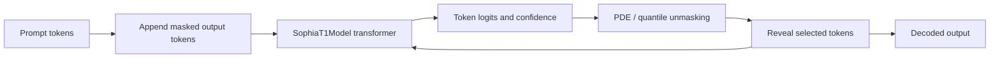
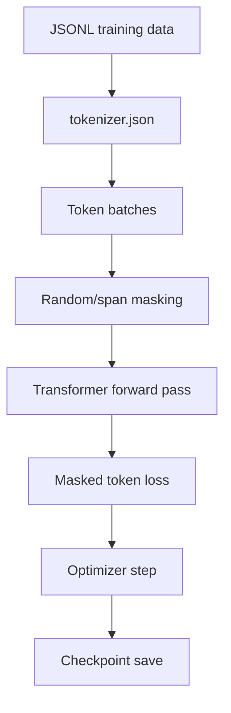

# Cassandra T1 Architecture

The current repository includes the Cassandra/Sophia T1 PyTorch implementation. The architecture is defined primarily in `src/model/sophia_t1.py` and configured by `src/model/config.py`.

## High-Level Architecture

## Model Components

- Token embeddings over a 32,768-token vocabulary.
- Transformer blocks with grouped-query attention.
- RoPE positional encoding.
- RMSNorm normalization.
- SwiGLU feed-forward layers.
- Masked-token training and generation utilities.
- Optional Q3-style AdaLN and confidence-head additions for continuation experiments.
- Experimental spatial-token utilities in `src/model/spatial_tokens.py`.

## Configuration

Default T1-Base values from `SophiaT1Config`:

- `hidden_size`: 2048
- `num_layers`: 28
- `num_heads`: 16
- `num_kv_heads`: 4
- `intermediate_size`: 5632
- `max_seq_len`: 131072
- `sliding_window`: 4096
- `global_tokens`: 256
- `mask_token_id`: 32766
- `pad_token_id`: 32767
- `num_denoise_steps_inference`: 12

## Training Flow

## Inference Flow

The released inference scripts load the checkpoint and tokenizer, append mask tokens after the prompt, run denoising steps, reveal selected tokens, and decode the result.

Relevant files:

- `scripts/run_cassandra.py`
- `scripts/chunk_gen.py`
- `scripts/serve_ep5.py`
- `src/scheduler/pde_lattice.py`
- `src/model/sophia_t1.py`

## Experimental Areas

- Spatial token vocabulary design exists, but source notes indicate spatial tokens were not fully active in the epoch-5 training data.
- The v2 scratch checkpoint is newer than epoch 5, but comparison output suggests instability.
- GGUF conversion is not included because the custom architecture is not directly supported by standard llama.cpp conversion paths.
