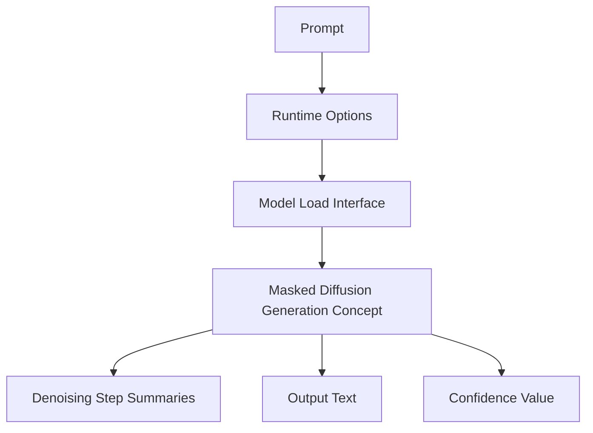
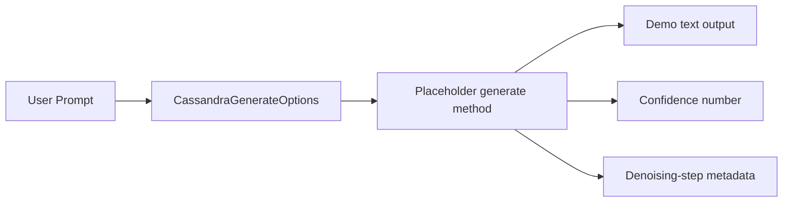
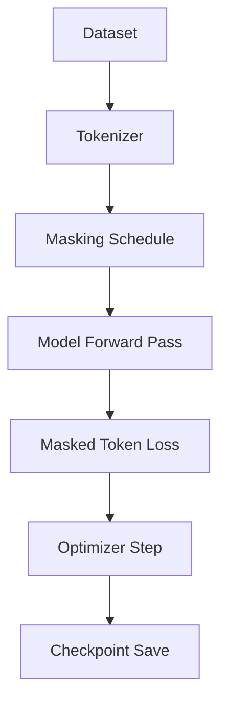
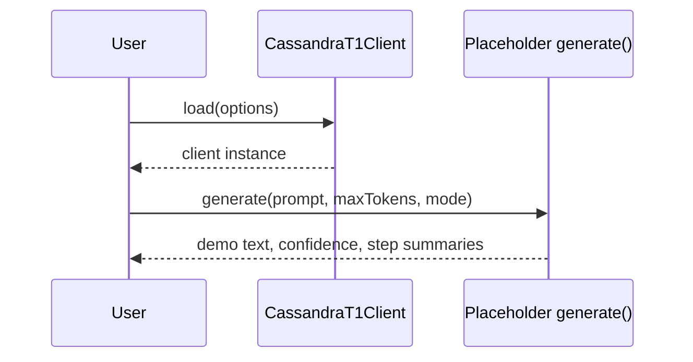

# Cassandra T1 Architecture

The current repository indicates that Cassandra T1 is intended to be a masked-diffusion language model, but the actual neural network implementation is not present. The architecture below is therefore based on the repository documentation and the placeholder TypeScript interface in `examples/cassandra.demo.ts`.

## High-Level Architecture

Cassandra T1 is documented as a sequence-generation model that starts from masked token uncertainty and refines output over a fixed number of denoising steps. The example API exposes a solver option, step count, target device, prompt, max token count, generation mode, output format, confidence, and step summaries.



## Model Components

### Components Found In Code

The file `examples/cassandra.demo.ts` defines:

- `CassandraLoadOptions`
- `CassandraGenerateOptions`
- `CassandraOutput`
- `CassandraT1Client`
- `CassandraT1Client.load`
- `CassandraT1Client.generate`

The code currently marks runtime initialization as a placeholder and states that the actual Cassandra runtime should be connected once weights and inference code are released.

### Components Described In Documentation

The documentation describes:

- masked output fields
- PDE-lattice scheduling
- parallel denoising
- confidence maps
- selective refinement
- edge-oriented deployment targets

### Components Not Found

No actual transformer block, embedding layer, attention module, normalization layer, positional encoding implementation, diffusion scheduler implementation, tokenizer implementation, loss function, optimizer setup, or checkpoint loader was found in the repository.

## Data Flow



## Training Flow

The repository states the model is at a 5-epoch proof-of-concept stage, but no training flow implementation was found.

Expected future training flow:



This diagram represents the likely intended direction, not code that is currently present in the repository.

## Inference Flow

The current placeholder inference flow is:



The code does not currently load weights or execute a model.

## Configuration Structure

`.env.example` includes:

```text
CASSANDRA_API_BASE_URL=
CASSANDRA_API_KEY=
```

These values are placeholders only. No server code currently consumes them in this repository.

The example load options include:

- `weights`
- `solver`
- `steps`
- `device`

## Experimental Areas

- Masked-diffusion generation
- PDE-lattice scheduling
- Parallel denoising interface
- Confidence-aware output metadata
- Edge-runtime direction

## Unknowns Or Missing Pieces

- Actual model definition
- Tokenizer implementation
- Dataset format
- Training loop
- Optimizer and learning-rate schedule
- Checkpoint format
- Evaluation methodology implementation
- Real inference runtime
- API/server implementation
- Deployment architecture

