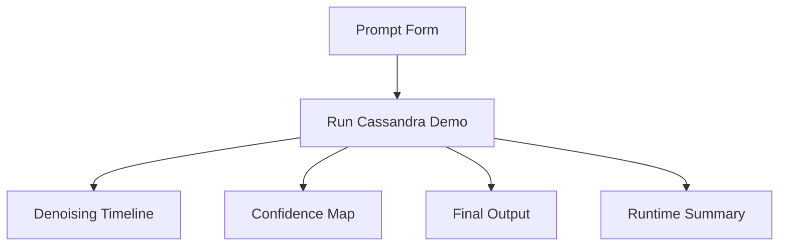

# Demo Interface

The Cassandra demo should show masked diffusion in a way that a technical buyer or developer can understand quickly. The demo should prioritize clarity over hype.

## Answer First: What Should The Demo Show?

The demo should show Cassandra starting with masked uncertainty, establishing semantic anchors, refining all positions in parallel, and returning a final output with confidence metadata. It should make the difference from autoregressive left-to-right generation obvious.

## Demo Inputs

The public demo should accept:

- Prompt
- Task type
- Output mode
- Maximum token budget
- Denoising steps
- Optional schema
- Optional context blocks

## Demo Output

The demo should display:

- Final answer
- Step-by-step denoising view
- Confidence map
- Low-confidence spans
- Runtime estimate
- Token budget
- Comparison note against autoregressive generation

## Example Demo Scenario

Input:

```text
Summarize this repair log and route the next action:
Customer reports refrigerator warm, freezer still cold, condenser fan running, evaporator fan intermittent.
```

Expected demo output:

```json
{
  "summary": "The repair log suggests an airflow or evaporator fan issue rather than a sealed-system failure.",
  "nextAction": "Inspect evaporator fan operation, door switch state, frost pattern, and airflow obstruction before ordering compressor parts.",
  "confidence": 0.87,
  "lowConfidenceSpans": ["intermittent fan cause requires confirmation"]
}
```

## UI Structure



## TypeScript Surface

```ts
export interface CassandraDemoRequest {
  prompt: string;
  taskType: "workflow" | "diagnostic" | "document_qa" | "code_repair" | "routing";
  outputMode: "text" | "json" | "code" | "report";
  maxTokens: number;
  steps: 8 | 12 | 16;
  context?: string[];
}

export interface CassandraDemoResponse {
  text: string;
  confidence: number;
  steps: CassandraDenoiseStep[];
  lowConfidenceSpans: string[];
  runtimeMs: number;
}

export interface CassandraDenoiseStep {
  step: number;
  label: string;
  tokens: string[];
  averageConfidence: number;
}
```

## Demo Safety

- Do not expose private model endpoints in client-side code.
- Do not expose API keys.
- Do not imply public benchmark certification unless benchmark artifacts are available.
- Label mock visualizations as demos when weights are not running behind the UI.

