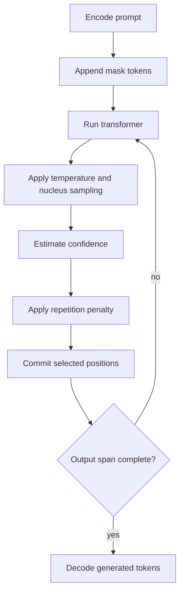

# Inference Design

Cassandra T1 inference is built around masked-span refinement. The model receives the prompt and a block of mask tokens, predicts over the full sequence, selects positions to reveal, and repeats the process until the generated span is filled. The current implementation is intentionally direct so the generation behavior is visible in code.

## Entry Points

- `scripts/run_cassandra.py`: local CUDA inference path for the epoch-5 checkpoint.
- `scripts/chunk_gen.py`: chunk-based generation experiment.
- `scripts/serve_ep5.py`: Flask server with an OpenAI-style `/v1/chat/completions` route.
- `src/eval/canary_identity.py`: small canary prompt harness for qualitative checks.

## Generation Loop

## Design Notes

The epoch-5 path combines several practical controls:

- Nucleus sampling to avoid pure greedy collapse.
- Repetition penalty to reduce repeated token loops.
- Chunk generation to keep refinement windows manageable.
- Confidence-guided position selection.
- 8-16 denoising steps depending on script and settings.

These controls are still experimental. The release does not claim the current sampler is final. It provides a baseline that can be measured against future unmasking policies.

## Current Behavior

Epoch 5 is usable as a proof-of-concept inference target. It can produce short outputs, but longer outputs remain unstable. The v2 scratch checkpoint is included for further evaluation, but available notes do not justify treating it as a better inference target yet.

The next inference work should focus on repeatable decoding experiments: same prompts, same checkpoint, same settings, recorded outputs, latency, and memory use.
