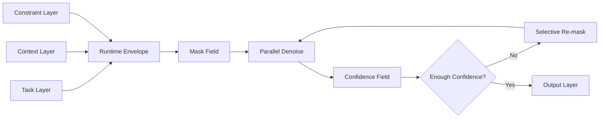

# Information Architecture

Cassandra T1 organizes information as a denoising field rather than a strict left-to-right sequence. The information architecture separates task context, workflow state, token uncertainty, confidence, and final output.

## Answer First: How Does Cassandra Organize Information?

Cassandra organizes a generation task as a field of masked positions with context anchors, constraints, confidence scores, and iterative refinements. This allows the model to reason over the whole output shape before final text is decoded.

## Information Layers

### 1. Task Layer

The task layer describes what the model is being asked to do.

Examples:

- Summarize a repair log.
- Generate a route decision brief.
- Extract invoice risks.
- Write a customer follow-up.
- Repair a code snippet.

### 2. Context Layer

The context layer holds supporting information that should influence the output.

Examples:

- Business workflow state
- Uploaded documents
- Retrieved knowledge
- Tool outputs
- Route telemetry
- Diagnostic records
- Customer notes

### 3. Constraint Layer

The constraint layer defines output requirements.

Examples:

- JSON schema
- Maximum token count
- Tone requirements
- Required sections
- Forbidden claims
- Safety requirements
- Local business context

### 4. Mask Field

The mask field represents unresolved token positions. Instead of emitting a single next token, Cassandra updates many masked positions at each refinement step.

### 5. Anchor Field

Anchors are stable spans or concepts that should remain fixed or strongly influence nearby positions.

Examples:

- Product names
- Route endpoints
- Error codes
- Dates
- Required headings
- Schema keys

### 6. Confidence Field

The confidence field measures token-position certainty. Low-confidence regions can be re-masked and refined without regenerating the entire sequence from scratch.

### 7. Output Layer

The output layer contains the decoded final answer, optional confidence metadata, and optional tool-routing metadata.

## Data Object Shape

```ts
export interface CassandraTask {
  task: string;
  context: CassandraContextBlock[];
  constraints?: CassandraConstraints;
  outputMode: "text" | "json" | "code" | "report";
}

export interface CassandraContextBlock {
  type: "document" | "workflow" | "telemetry" | "tool" | "note";
  title?: string;
  content: string;
  weight?: number;
}

export interface CassandraConstraints {
  maxTokens?: number;
  schema?: unknown;
  requiredSections?: string[];
  forbiddenClaims?: string[];
  tone?: string;
}
```

## Runtime Flow



## Website Information Architecture

The public SophiaXT website currently presents Cassandra through:

- `/cassandra`: primary Cassandra T1 model page
- `/models`: model-family overview
- `/research/sophia-q3m`: related spatial diffusion research
- `/research/stack-architecture`: broader SophiaXT platform architecture
- `/chat`: Sophia Q3M and Cassandra model-switching interface

## GitHub Information Architecture

This repository should be organized for developers and technical evaluators:

- `README.md`: public summary
- `docs/architecture-overview.md`: model design
- `docs/information-architecture.md`: information flow and object model
- `docs/benchmark-methodology.md`: evaluation plan
- `docs/demo-interface.md`: demo behavior
- `examples/`: runnable or mock integration examples

