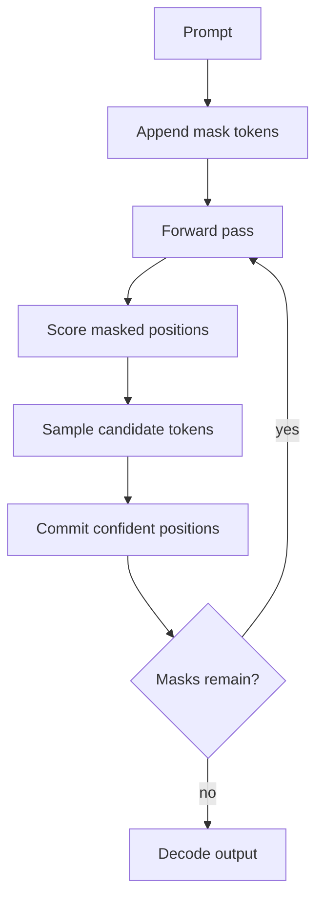

# Cassandra T1: Prototype Research Note

## Abstract

Cassandra T1 is a SophiaXT prototype language model exploring masked-diffusion generation for text. The system combines a compact transformer backbone, grouped-query attention, RoPE position encoding, RMSNorm, SwiGLU feed-forward layers, masked-token training, and a PDE-inspired unmasking scheduler. This release includes model code, scheduler code, tokenizer artifacts, inference scripts, training scripts, and two checkpoint artifacts. The purpose of the release is architecture transparency and proof-of-concept validation, not a claim of production readiness.

## 1. Motivation

Most deployed language models are autoregressive. They generate one token at a time, and every downstream token is conditioned on the previous committed sequence. This approach is powerful, but it makes generation inherently sequential.

Cassandra T1 investigates a different question: can a smaller language model generate useful text by treating the output as a masked field that is refined over multiple denoising passes? In this framing, the model does not simply ask "what token comes next?" It asks which masked positions are ready to be resolved at the current denoising step.

The prototype is valuable because it makes this research direction concrete. It has a working architecture, checkpoints, tokenizer, training scripts, and inference scripts that can be inspected and improved.

## 2. Model Architecture

The T1-Base configuration uses a 28-layer transformer with 2,048 hidden dimensions, 16 query heads, 4 KV heads, SwiGLU feed-forward layers, RMSNorm, and RoPE. The vocabulary contains 32,768 tokens, with mask and pad tokens reserved at the top of the vocabulary.

The architecture includes optional timestep conditioning through zero-initialized AdaLN modules. This is important for prototype continuity: an older checkpoint can load into the enhanced architecture without immediate behavioral drift, while future continuation training can learn timestep-specific modulation.

## 3. Masked-Diffusion Generation

During generation, Cassandra T1 appends a masked span after the prompt. The transformer predicts logits for all positions, confidence is estimated for masked positions, and selected tokens are committed. The process repeats until the output span is filled.

This is the central prototype behavior. It differs from standard autoregressive decoding not because it magically removes sequence dependence, but because it changes the unit of generation from "next token" to "field refinement."

## 4. Training Measurements

The source project notes record the following loss progression:

| Stage | Recorded loss |
|---|---:|
| Epoch 1 | 3.78 |
| Epoch 2 | 2.89 |
| Epoch 3 | 2.67 |
| Epoch 4 | 2.42 |
| Epoch 5 | 2.2561 |

These values show meaningful optimization progress through epoch 5. They are not benchmark results. They do not establish parity with larger autoregressive systems. They do show that the training loop, checkpointing flow, and masked objective produced a usable research artifact.

## 5. Released Checkpoints

| Checkpoint | Role | Current interpretation |
|---|---|---|
| `cassandra_ep5_fp16.pt` | Verified epoch-5 checkpoint | Most stable released checkpoint for the current inference scripts. |
| `v2_scratch_epoch2_82002.pt` | Newest checkpoint found by timestamp | Included for transparency; qualitative comparison notes suggest instability. |

The release uses split checkpoint parts because the original files exceed GitHub's individual LFS object limit. Reassembled hashes are documented in the root README and `weights/README.md`.

## 6. Observed Behavior

The epoch-5 checkpoint is described in the source notes as more useful for short factual answers than earlier checkpoints. Longer creative responses can still degrade. Identity behavior is partially learned, not reliable. The v2 scratch checkpoint is newer but showed unstable repetition in comparison output.

This matters because it shapes the next research step. The most important goal is not to publish a larger file. It is to identify which checkpoint is actually more stable under a fixed prompt suite, then continue training from that point with better data and stricter evaluation.

## 7. Future Training Plan

Future training should improve Cassandra T1 through measured iteration:

- Establish a fixed regression prompt suite before the next run.
- Separate short factual QA, long-form generation, identity prompts, service-domain reasoning, spatial/layout prompts, and code prompts.
- Continue from the most stable checkpoint, not simply the newest checkpoint.
- Improve the identity and instruction-following distribution.
- Integrate spatial tokens into the actual tokenized training path before making spatial-performance claims.
- Log loss, canary outputs, decoding settings, latency, memory use, checkpoint hashes, and qualitative failure modes for each release.

## 8. Conclusion

Cassandra T1 is a real prototype, not a finished model. Its value is that the architecture and artifacts are now visible: code, tokenizer, checkpoints, scheduler, training path, and inference path. The next phase should turn the prototype into a measured model-development loop where each checkpoint is evaluated, compared, and improved under reproducible conditions.
