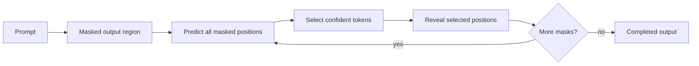

# Why Cassandra T1 Uses Masked Diffusion

Cassandra T1 is being built to explore a different path for language-model generation. Most large language models today use autoregressive decoding: they generate one token, commit to it, then generate the next token from that growing sequence. This approach works extremely well, but it also creates a structural bottleneck. Every new token depends on the previous token being finished first.

Cassandra T1 investigates whether a compact language model can generate useful text through masked diffusion instead. In this approach, the model starts with a prompt and a masked output region. It predicts many positions at once, commits the most confident tokens, then repeats the process until the output is complete.

The goal is not to claim that masked diffusion already beats mature autoregressive models. The goal is to build a working prototype that can be trained, measured, improved, and eventually optimized for edge deployment.

## The Core Reasoning

Autoregressive models are strong because they preserve a clear order: left to right, one token at a time. That order also limits parallelism. A 500-token answer generally requires hundreds of sequential generation decisions.

Masked diffusion changes the control problem. Instead of asking only "what comes next?", Cassandra T1 asks "which masked positions are ready to resolve now?" The model can look across the prompt and the partially completed output, then refine the whole candidate span over several passes.

This gives Cassandra T1 a research path toward:

- parallel token refinement
- shorter generation schedules
- different repetition behavior than left-to-right decoding
- compact checkpoints that can be optimized for local and edge devices
- domain-specific model variants for technical workflows

## Why PDE-Inspired Scheduling Matters

Masked diffusion needs a policy for deciding how aggressively to reveal tokens. If it reveals too many tokens too early, the output can collapse into bad patterns. If it reveals too slowly, inference loses the speed advantage that makes diffusion interesting.

Cassandra T1 uses a PDE-inspired scheduling direction to control that reveal process. The scheduler is not just a cosmetic component. It is part of the model's generation behavior: it determines how the masked sequence moves from uncertainty toward a completed answer.

In practical terms, the scheduler should help answer:

- How many tokens should be unmasked at each step?
- Which positions are confident enough to commit?
- When should the model slow down and refine difficult positions?
- How can the generation process avoid collapse into repetitive tokens?

The current release includes scheduler experiments, but this area still needs more measurement. The v2 scratch comparison already shows why this matters: a newer checkpoint can still collapse into repetitive patterns if the model state, data balance, or decoding policy is not stable.

## Why Compact Models Matter

Cassandra T1 is also about deployment constraints. Very large models are powerful, but they often require cloud infrastructure, expensive GPUs, high memory, and high latency. Many useful business, diagnostic, coding, and research workflows do not need a giant general model if a smaller specialized model can run locally with acceptable quality.

The long-term direction is a family of dense, compact models that can support:

- local inference
- lower operational cost
- private workflows
- edge-device experimentation
- specialized vertical models
- faster iteration for domain-specific systems

This is why Cassandra T1 is being released as a prototype rather than hidden behind a demo. The architecture, tokenizer, checkpoint artifacts, training code, and inference path need to be visible so the model can improve through measurement.

## Current Status

Phase 1 is complete at the prototype-release level:

- initial Cassandra T1 training checkpoint released
- tokenizer released
- architecture code released
- scheduler code released
- training and inference scripts released
- checkpoint coherence comparison added

The epoch-5 checkpoint is the more useful baseline from the current release. The newer v2 scratch checkpoint is included for transparency, but comparison output indicates stronger repetition collapse and lower practical coherence in the captured test.

## Roadmap

### Phase 1: Foundation

Current release goals:

- complete initial training and release of the Cassandra T1 prototype
- validate the masked-diffusion training path
- release code, tokenizer, and checkpoints
- document current limitations and checkpoint behavior

Status: complete for public prototype release.

### Phase 2: Optimization

Next 3-6 months:

- scale training with better data and longer schedules
- refine the PDE-inspired unmask scheduler for speed and coherence
- add formal evaluation benchmarks such as MMLU, GSM8K, HumanEval, and domain-specific tests
- improve long-form generation stability
- reduce repetition collapse
- publish checkpoint-specific model cards

### Phase 3: Edge Deployment

Target 6-12 months:

- optimize the model for real local and edge devices
- test quantization paths that support the custom architecture
- measure latency, RAM, VRAM, and throughput across hardware profiles
- develop a cleaner inference engine
- release a stronger small model in the 3B-7B class if training results justify the scale-up

### Phase 4: Advanced Capabilities

Target 12-24 months:

- integrate structured reasoning improvements
- improve lattice-based scheduling and confidence estimation
- explore instruction tuning and alignment
- build specialized model variants for diagnostics, coding, research, and technical service workflows
- add reproducible public evaluation packages for each major release

## Design Philosophy

Cassandra T1 is not being built to imitate the largest cloud models directly. It is being built to test whether a smaller model can use a different generation process, a focused training path, and an edge-aware architecture to become useful in constrained environments.

The current prototype is early, but the architecture direction is clear: compact masked-diffusion models, measured checkpoint releases, practical inference paths, and a roadmap toward specialized local intelligence.
