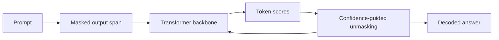

# Cassandra T1 Open Release

Cassandra T1 is SophiaXT's experimental masked-diffusion language model prototype. This release includes checkpoints, tokenizer artifacts, PyTorch model code, scheduler code, training scripts, and inference scripts for technical review.

## What It Shows

The release shows a complete model-development path: architecture definition, training loop, tokenizer, checkpoint artifacts, and an inference route. That matters because it gives technical reviewers more than a visual demo. They can inspect how the model is built, how masking is handled, how denoising is performed, and where the current implementation still needs work.

## Current Checkpoints

- `cassandra_ep5_fp16.pt`: verified epoch-5 checkpoint, published as two Git LFS parts.
- `v2_scratch_epoch2_82002.pt`: newest checkpoint found in the source directory, published as nine Git LFS parts.
- `tokenizer.json`: tokenizer artifact used by the release scripts.

Epoch 5 is currently the more stable checkpoint described in the notes. The v2 scratch checkpoint is newer, but preliminary comparison output indicates instability, so it is included for transparency and future analysis rather than presented as the best model.

## Architecture Concept

Cassandra T1 does not generate by simply typing one token after another. It fills a masked region through repeated refinement. The present implementation uses a compact transformer with grouped-query attention, RoPE, RMSNorm, SwiGLU layers, and masked-token objectives.

## Why It Matters

This prototype is a step toward SophiaXT models that can be inspected, trained, deployed, and improved without depending entirely on closed external systems. It also creates a concrete testbed for diffusion-style language generation, checkpoint comparison, edge-focused model design, and domain-specific training.

## Current Limits

- Long-form output needs additional training and evaluation.
- Identity behavior is not fully reliable.
- No formal public benchmark suite is included yet.
- Training data is not included.
- Scripts still need path cleanup for portable use.
- Spatial-token code exists, but spatial capability needs active-data integration and measurement.

## Next Milestones

- Add clean installation and runtime instructions.
- Publish checkpoint-specific model cards.
- Add reproducible evaluation prompts and outputs.
- Continue training from the most stable checkpoint.
- Measure every future checkpoint against the same prompt suite before calling it an improvement.
