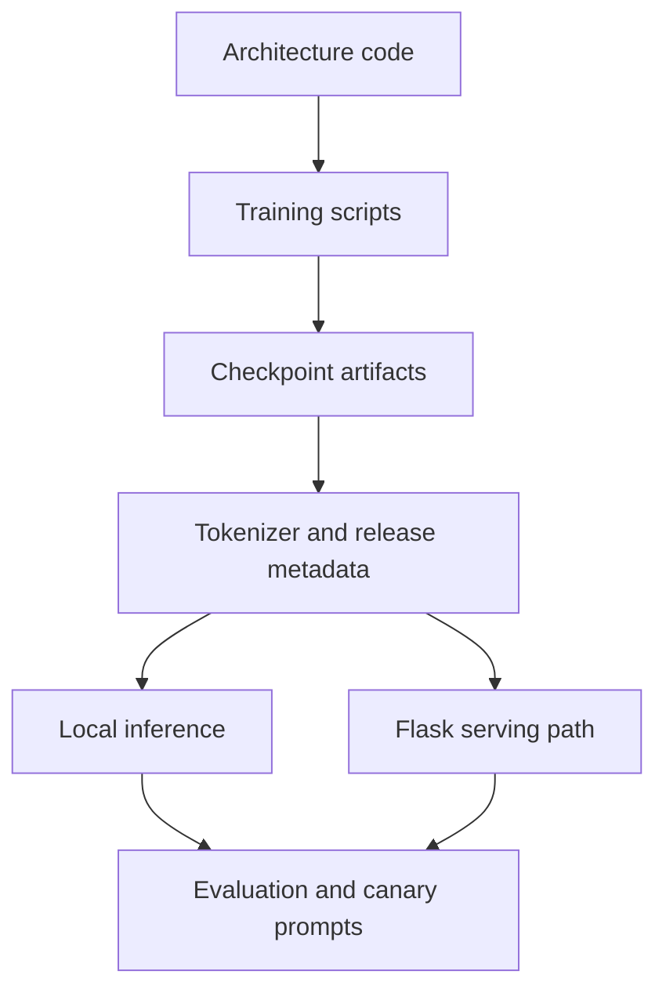

# SophiaXT Stack Showcase

Cassandra T1 is a public view into the SophiaXT model-development stack. It shows the path from research idea to model code, training loop, scheduler logic, tokenizer, checkpoint artifacts, and inference service. The release is not framed as a finished commercial model. It is framed as a working laboratory prototype with enough of the system exposed for meaningful technical review.

## Stack Layers

## What the Stack Demonstrates

- `src/model/` contains the transformer architecture, configuration, and spatial-token utilities.
- `src/scheduler/` contains the PDE lattice and diffusion scheduler experiments.
- `src/train/` contains scratch, continuation, QLoRA, and merge training paths.
- `scripts/` contains local and server inference entry points.
- `release/tokenizer.json` preserves the tokenizer artifact used by the model scripts.
- `weights/` contains the released checkpoint parts and checksums.

## Technical Meaning

The important point is continuity. Cassandra T1 is not just a page describing a future model. It is a connected release where the architecture, training process, checkpoint files, and inference code can be examined together. That makes the prototype useful even while output quality is still early.

## Current Boundary

Epoch 5 is the verified proof-of-concept checkpoint. The newer v2 scratch checkpoint is included for transparency, but it needs controlled evaluation before being treated as an improvement. The stack should now evolve through measured releases: fixed prompts, tracked losses, latency records, memory records, output samples, and checkpoint-specific model cards.
